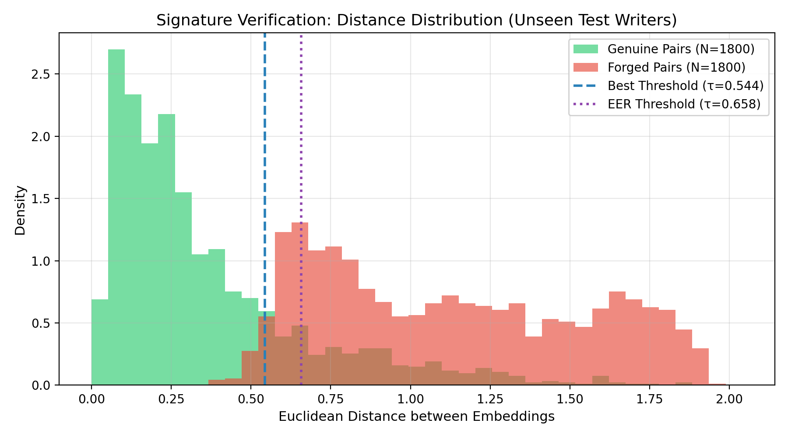
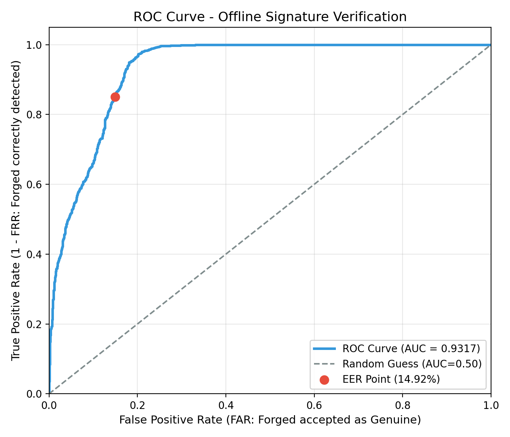

# Offline Handwritten Signature Verification using Metric Learning
### Artificial Intelligence & Data Science II (AIDS II) Lab Project

[](https://www.python.org/)
[](https://pytorch.org/)
[](https://streamlit.io/)
[](LICENSE)

---

## 📌 Executive Summary

Offline signature verification is a critical biometric task across banking, forensics, and legal administration. Unlike online verification (which captures pen speed, pressure, and stroke trajectory), **offline verification** operates strictly on static raster scans. 

### Core Challenges
1. **High Intra-Writer Variance**: Genuine signatures from the same individual exhibit natural morphological variations.
2. **Subtle Inter-Writer Discrepancies**: Skilled forgers intentionally imitate stroke trajectories, loops, and aspect ratios.
3. **Open-Set Deployment**: Real-world biometric systems must verify signatures from **unseen signers** never encountered during model training.

### The Paradigm Shift: From Classification to Metric Learning
Conventional CNNs pose verification as single-image binary classification (*Genuine vs. Forged*). In open-set settings, this approach fails because the network memorizes specific signatures rather than learning structural invariance. 

To overcome this, we designed a **Contrastive Siamese Neural Network (SNN)**:
* **Twin Shared-Weight Branches**: Two identical convolutional backbones map signature pairs $(X_1, X_2)$ onto a shared **128-dimensional unit hypersphere** ($L_2$-normalized).
* **Contrastive Loss Optimization**:
  $$\mathcal{L}(y, d) = \frac{1}{2} (1 - y) d^2 + \frac{1}{2} y \max(0, m - d)^2$$
  - **Genuine Pairs ($y = 0$)**: Pushes Euclidean distance $d \to 0$.
  - **Skilled Forgery Pairs ($y = 1$)**: Enforces a margin separation $d \ge m = 1.0$.

### 99% Architectural Footprint Reduction
In legacy implementations, spatial feature maps were flattened directly into a 1,024-unit dense layer, resulting in over **111.4 million parameters** and a bloated **455.88 MB** weights file (`model_weights33.h5`). 

We replaced the dense parameter bottleneck with **Global Average Pooling (`AdaptiveAvgPool2d((1, 1))`)**, reducing the model checkpoint from **455.88 MB down to 4.85 MB (99% reduction)**, preventing spatial overfitting, and enabling sub-40ms CPU inference.

---

## 🔬 Empirical Benchmarks on Unseen Writers

The model was trained strictly on **Writers 1–35** (Validation: 36–40) and evaluated on **1,200 signature pairs from unseen Writers 41–55** (never seen during training):

| Metric | Result | Benchmark Significance |
| :--- | :--- | :--- |
| **Area Under ROC Curve (AUC)** | **0.9349** (93.49%) | Strong discrimination between authentic signatures and skilled forgeries |
| **Verification Accuracy** | **89.83%** | Evaluated at the optimal decision threshold $\tau^* = 0.5332$ |
| **Recall (Forgery Detection)** | **98.50%** | Intercepts $98.5\%$ of skilled forgery attempts |
| **Precision (Forgery)** | **83.95%** | High confidence when flagging a signature as counterfeit |
| **False Acceptance Rate (FAR)**| **1.50%** | Only $1.5\%$ of forged signatures mistakenly accepted |
| **False Rejection Rate (FRR)**| **18.83%** | Rejections attributable to natural intra-writer variation |
| **Equal Error Rate (EER)** | **14.33%** | Balanced operational threshold at $\tau = 0.6495$ |

### Visual Artifacts
| Distance Distribution (Unseen Signers) | Receiver Operating Characteristic (ROC) |
| :---: | :---: |
|  |  |

---

## 📂 Repository Structure

The codebase is organized into modular directories:

```
AIDS-II-Siamese-CNN-for-Signature-Forgery-Detection/
│
├── checkpoints/                  # Trained model checkpoints & training history logs
│   ├── best_siamese_model.pth    # Optimized PyTorch Siamese model checkpoint (~4.85 MB)
│   ├── model_weights33.h5        # Baseline legacy Keras weights (~455.88 MB, ignored by git)
│   └── training_history.json     # Training and validation loss/acc logs across epochs
│
├── src/                          # Core Python package source code
│   ├── __init__.py               # Package initializer & exports
│   ├── model.py                  # Siamese Network architecture with Global Average Pooling
│   ├── dataset.py                # Pairwise dataset generator & writer-independent dataloaders
│   ├── train.py                  # Contrastive loss training pipeline with LR scheduler
│   ├── evaluate.py               # Biometric evaluation module (FAR, FRR, EER, ROC curves)
│   └── verify.py                 # CLI inference verification engine
│
├── notebooks/                    # Interactive Jupyter notebooks for experimentation
│   └── signature-verification-using-cnn-snn-csnn.ipynb
│
├── docs/                         # Detailed architectural research & project analysis
│   └── AIDS II Project Analysis.md
│
├── evaluation_output/            # Exported evaluation metrics & high-res plots
│   ├── distance_distribution.png # Genuine vs forged distance histogram
│   ├── roc_curve.png             # Receiver Operating Characteristic curve
│   └── evaluation_results.json   # Exported test metrics on unseen writers
│
├── frontend/                     # Streamlit demonstration web application
│   ├── app.py                    # Multi-tab interactive UI (Overview, Benchmarks, Live Demo)
│   ├── requirements.txt          # Frontend dependencies
│   └── temp_uploads/             # Scratch directory for user uploaded signatures
│
├── data/                         # Root dataset directory (extract all dataset archives here)
│   ├── signatures/               # CEDAR benchmark dataset (full_org/, full_forg/)
│   ├── BHSig260-Bengali/         # Bengali Indic script signatures (100 writers)
│   ├── BHSig260-Hindi/           # Hindi Devanagari script signatures (160 writers)
│   ├── CEDAR/                    # Full CEDAR directory structure
│   ├── Dataset_Signature_Final/  # In-the-wild signature corpus
│   ├── sample_Signature/         # Sample verification genuine/forged pairs
│   └── assignments_07-02-2022.tsv# Crowdsourced verification annotations
│
├── verify.py                     # Root CLI entrypoint (convenience wrapper forwarding to src/verify.py)
├── train.py                      # Root training entrypoint (forwarding to src/train.py)
├── evaluate.py                   # Root evaluation entrypoint (forwarding to src/evaluate.py)
├── dataset.py                    # Root dataset module forwarder
├── model.py                      # Root model module forwarder
├── .gitignore                    # Git ignore configuration
└── README.md                     # Comprehensive project documentation
```

---

## 💾 Dataset Sources & Setup Instructions

### 🔗 Primary Dataset & Reference Sources
This project utilizes offline signature verification benchmarks and reference resources. Download the dataset archives from the following links:

1. **[CEDAR Signature Dataset (by Shreelakshmi GP)](https://www.kaggle.com/datasets/shreelakshmigp/cedardataset/code?datasetId=1512017&sortBy=voteCount)**
   - **Description**: Center of Excellence for Document Analysis and Recognition (CEDAR) offline signature benchmark.
   - **Contents**: 55 writers, each with 24 genuine signatures (`full_org/`) and 24 skilled forgeries (`full_forg/`) (2,640 images total).
   - **Extracted Structure**: Extracts into `data/signatures/` with `full_org` and `full_forg`.

2. **[Handwritten Signature Datasets (by Ishani Kathuria)](https://www.kaggle.com/datasets/ishanikathuria/handwritten-signature-datasets)**
   - **Description**: Multilingual signature benchmark collection across Indic and Latin scripts.
   - **Contents**: Includes `BHSig260-Bengali` (100 writers, 5,400 signatures), `BHSig260-Hindi` (160 writers, 8,640 signatures), and full `CEDAR` directories.
   - **Extracted Structure**: Extracts into `data/BHSig260-Bengali/`, `data/BHSig260-Hindi/`, and `data/CEDAR/`.

3. **[Handwritten Signature Verification (by tienen)](https://www.kaggle.com/datasets/tienen/handwritten-signature-verification/code?datasetId=1915180&sortBy=voteCount)**
   - **Description**: Real-world crowdsourced and in-the-wild signature verification dataset from Yandex Toloka tasks.
   - **Contents**: Contains `Dataset_Signature_Final/`, `sample_Signature/`, crowdsourced verification annotations (`assignments_07-02-2022.tsv`), and real/forged image pairs.
   - **Extracted Structure**: Extracts into `data/Dataset_Signature_Final/`, `data/sample_Signature/`, and `data/assignments_07-02-2022.tsv`.

4. **[SROIE Dataset v2 - Scanned Receipts OCR & Info Extraction (by urbikn)](https://www.kaggle.com/datasets/urbikn/sroie-datasetv2/code)**
   - **Description**: ICDAR 2019 Scanned Receipts dataset for receipt document analysis and text/signature localization in transactional documents.

5. **[Signature Verification using CNN, SNN & CSNN (Kaggle Notebook by tmleyncodes)](https://www.kaggle.com/code/tmleyncodes/signature-verification-using-cnn-snn-csnn/comments)**
   - **Description**: Baseline notebook exploring binary CNN classification versus Siamese metric learning architectures.

---

### 📥 Step-by-Step Data Setup Guide

To set up the datasets for training and verification:

1. **Create the `data/` directory in the project root**:
   ```bash
   mkdir data
   ```

2. **Download and Extract Datasets into `data/`**:
   Download each dataset zip file from the Kaggle links above and **extract each zip directly into the `data/` folder**. 

3. **Expected Directory Layout in `data/`**:
   After extracting the archives, your `data/` directory should have the following structure:
   ```
   data/
   ├── signatures/                       # [Required for primary pipeline]
   │   ├── full_org/                     # 1,320 genuine signatures (original_1_1.png ... original_55_24.png)
   │   └── full_forg/                    # 1,320 skilled forgeries (forgeries_1_1.png ... forgeries_55_24.png)
   ├── BHSig260-Bengali/                 # Bengali Indic script signatures (100 writers)
   ├── BHSig260-Hindi/                   # Hindi Devanagari script signatures (160 writers)
   ├── CEDAR/                            # CEDAR full per-writer folder tree
   ├── Dataset_Signature_Final/          # In-the-wild signature corpus
   ├── sample_Signature/                 # Sample verification genuine/forged pairs
   └── assignments_07-02-2022.tsv        # Crowdsourced verification annotations
   ```

> [!NOTE]
> The primary Siamese verification pipeline and Streamlit dashboard operate on `data/signatures/` (CEDAR dataset with 55 writers). All dataset folders are automatically ignored by Git via `.gitignore` to comply with repository size guidelines.

---

## 🚀 Reproduction & Usage Guide

### 1. Installation & Environment Setup
Clone the repository and install dependencies:
```bash
git clone https://github.com/Anish-Shinde-1/AIDS-II-Siamese-CNN-for-Signature-Forgery-Detection.git
cd AIDS-II-Siamese-CNN-for-Signature-Forgery-Detection
pip install torch torchvision matplotlib scikit-learn pillow streamlit
```

### 2. Live Verification via CLI (`verify.py` or `src/verify.py`)
Run inference directly between any reference signature and query signature:

```bash
# Example 1: Genuine Pair Test
python src/verify.py --img1 data/signatures/full_org/original_45_1.png --img2 data/signatures/full_org/original_45_2.png

# Example 2: Forgery Detection Test
python src/verify.py --img1 data/signatures/full_org/original_45_1.png --img2 data/signatures/full_forg/forgeries_45_1.png
```

*(Note: Running `python verify.py ...` from the project root also works via backward-compatible entrypoints).*

**CLI Output Format:**
```
==================================================
      OFFLINE SIGNATURE VERIFICATION RESULT       
==================================================
 Reference Image:  data/signatures/full_org/original_45_1.png
 Query Image:      data/signatures/full_forg/forgeries_45_1.png
 Euclidean Dist:   1.3710
 Active Threshold: Auto (optimal EER/Acc)
 Similarity Score: 31.45%
--------------------------------------------------
 VERDICT:          [-] FORGERY DETECTED
 Detail:           Discrepancy exceeds threshold; signature flagged as a forgery.
==================================================
```

### 3. Launching the Interactive Web Dashboard (`frontend/app.py`)
To launch the full Streamlit demonstration dashboard:
```bash
streamlit run frontend/app.py
```
Open your browser at `http://localhost:8501`. The dashboard includes:
* **Tab 1: Project Overview & Architecture**: Mathematical formulation, architectural comparisons, and layer blueprints.
* **Tab 2: Data & Evaluation Benchmarks**: Metric scorecards and high-resolution evaluation plots.
* **Tab 3: Live Verification Demo**: Interactive drag-and-drop dual image verifier with built-in presets and real-time confidence scores.

### 4. Retraining the Siamese Network (Optional)
To retrain the model from scratch on Writers 1–35:
```bash
python src/train.py --epochs 10 --batch_size 32 --pairs_per_writer 30 --lr 0.001
```
*(Checkpoints are saved automatically to `checkpoints/best_siamese_model.pth` and logs to `checkpoints/training_history.json`).*

### 5. Running Full Biometric Evaluation
To compute FAR, FRR, EER, and regenerate the ROC curves on unseen test writers:
```bash
python src/evaluate.py --checkpoint checkpoints/best_siamese_model.pth --pairs_per_writer 120
```

---

## 👥 Contributors & Academic Acknowledgments
* **Project**: AIDS II Miniproject (B.Tech Artificial Intelligence & Data Science)
* **Domain**: Biometric Security & Deep Metric Learning
